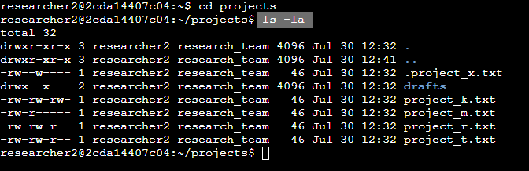
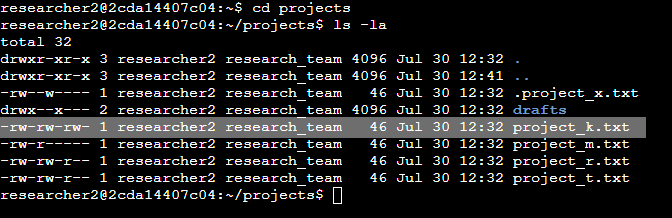
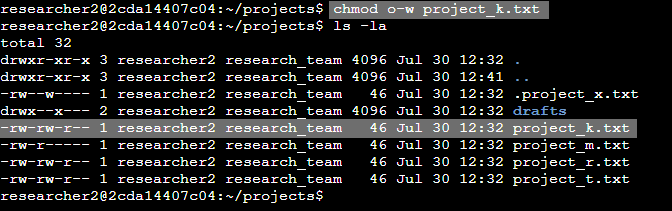
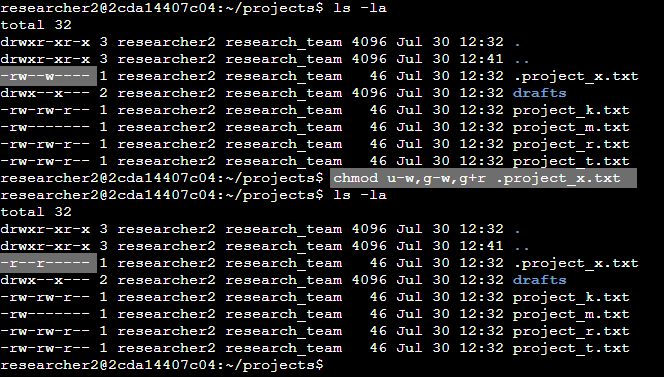
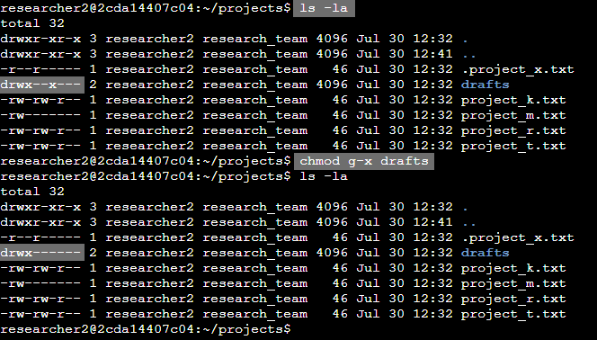

# File permissions in Linux
## Project Description
The research team at my organization (fictional) needs to update the file permissions for certain files and directories within the projects directory. The permissions do not currently reflect the level of authorization that should be given. Checking and updating these permissions will help keep their system secure. To complete this task, I performed the following tasks:

## Check file and directory details

To determine what permissions are currently set I used command `ls` with option `-la`. By itself command `ls` will just display the contents of the directory, but by using options `-l` (show current permissions) and `-a` (include hidden files) I was able to fully evaluate the current permission settings.

## Describe the permissions string
The 10-character string can be deconstructed to determine who is authorized to access the file and their specific permissions. The characters and what they represent are as follows:

- 1st character: This character is either a `d` or a hyphen (`-`) and indicates the file type. If it's a `d`, it's a directory. If it's a hyphen (`-`), it's a regular file.
- 2nd-4th characters: These characters indicate the read (`r`), write (`w`), and execute (`x`) permissions for the user. When one of these characters is a hyphen (`-`) instead, it indicates that this permission is not granted to the user.
- 5th-7th characters: These characters indicate the read (`r`), write (`w`), and execute (`x`) permissions for the group. When one of these characters is a hyphen (`-`) instead, it indicates that this permission is not granted for the group.
- 8th-10th characters: These characters indicate the read (`r`), write (`w`), and execute (`x`) permissions for other. This owner type consists of all other users on the system apart from the user and the group. When one of these characters is a hyphen (`-`) instead, that indicates that this permission is not granted for other.

For example, the file permissions for `project_t.txt` are `-rw-rw-r--`. Since the first character is a hyphen (`-`), this indicates that `project_t.txt` is a file, not a directory. The second, fifth, and eighth characters are all `r`, which indicates that the `user`, `group`, and `other` all have read permissions. The third and sixth characters are `w`, which indicates that only the `user` and `group` have write permissions. No one has execute permissions for `project_t.txt`.

## Change file permissions
The organization determined that `other` shouldn't have write access to any of their files. To comply with this, I referred to the file permissions that I previously returned. I determined that write permission for `other` should be taken for `project_k.txt` file.

I used the `chmod` command with 2 arguments: `o-w` and `project_k.txt`. The `chmod` command changes permissions for files and directories. The first argument indicates how to change permissions (take write permission from other) and the second is our target file.
Then, I used the `ls` command with `-la` option to check whether the command was successful.

## Change file permissions on a hidden file
The research team at my organization recently archived `.project_x.txt`. They do not want anyone to have write access to this project, but the `user` and `group` should have read access.
The following image demonstrates how this operation was done.

The first highlighted square shows what permissions were for the .project_x.txt file. The period (`.`) before a filename means that this file is a hidden file (hidden files and directories always start with a period).
 `-rw--w----` indicated that `user` and `group` have write permission but `group` does not have read permission. 
To fix this I used the `chmod` command with `u-w`, `g-w`, `g+r` arguments (second highlighted square). These arguments mean: `u-w` (take write permission from `user`), `g-w` (take write permission from `group`), `g+r` (give read permission to `group`). The third highlighted square shows that command was successful.

## Change directory permissions
My organization only wants the `researcher2` user to have access to the `drafts` directory and its contents. This means that no one other than `researcher2` should have execute permissions. The following image shows that I used the `chmod` command with `g-x` argument to the target `drafts` directory to take execute permission from `group` and it was successful.

## Summary
To establish the desired level of authorization in my organization I checked permissions for specific files and directories within the `projects` directory. The existing permissions did not align with the desired level of authorization, so the necessary corrective actions have been taken. Permissions were updated and the system is secure now.
